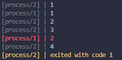

# @do4ng/process

```js
const { execute } = require("@do4ng/process");

execute("server", "node", ["./server.js"]);
execute("frontend", "npx", ["next dev"]);
```

---

## Example



[/test.js](./test.js)
